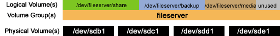

## Disk Partitioning Guidelines

A 10Tb sized storage is required for a full production Knowledge Base. As many infrastructure providers offer disks with lower capacity, a Logical Volume Management (LVM) Layout is used to overcome this issue. 

<center><p></img></p>
<p>Figure shows how LVM looks</p></center>

LVM allows you to use multiple disks capacity as, for example, one big logical volume. 

## Partitioning for LVM

When formatting available disks, choose only one disk for the operating system.

Install the OS in a relatively small /root partition. (25/30Gb should be enough). Then you can add the remaining OS disk capacity to the next disk.

Remember to use [GPT Partition Tables](https://www.systutorials.com/making-gpt-partition-table-and-creating-partitions-with-parted-on-linux/) to support large partition schemes.

For more details on disk partitioning follow [this guide](https://phoenixnap.com/kb/linux-create-partition)

## Create LVM

To create an LVM, follow the next simple recipe:

```sh
# -- Create LVM --
apt-get install lvm2
pvcreate /dev/sdkk1 /dev/sdkk2 etc
vgcreate vg1 /dev/sdkk1 /dev/sdkk2 etc
vgdisplay
#(copy total PE)
lvcreate -l 1901219 -n lvm vg1
#(where 1901219 is Total PE reported by vgdisplay)
mkfs.ext4 -m0 -Ldata /dev/vg1/lvm
```

## Mount

After the volume is created, you can mount it as you would mount any other unit.

1. Create a mount point

```sh
sudo mkdir -p /mnt/data
```

After that, mount the partition by entering

```sh
sudo mount -t auto /dev/vg1/lvm /mnt/data
```

Verify if partition is mounted by using ```df -hT```