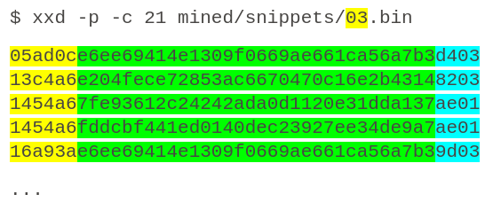

# Mining Process 

## Background 

This document describes the process for mining URLs from the internet into the LDB knowledgebase. The high level steps are: 

* URLs Mining 
* Download URLs 
* On-the-fly extraction of metadata 
* Archival of sources in .mz compressed format 
* Joining mined data 
* Mining snippets 
* Compilation 
* Importation 

The document also describes in detail how the mined information is saved.

## Prerequisites

Mining URLs requires a list of URLs to be mined, along with their corresponding vendor, component and version information.

## URL Mining 

This process involves downloading OSS components from the list of URLs using the minr tool. Minr downloads the provided URL and extracts the archive, saving file metadata and storing original sources in a .mz structure. The output of minr is a directory called mined/ with the following structure: 

### mined/components.csv 

Stores the list of URLs with their component MD5 hash, and the component metadata which includes vendor, component name and version. Example: 

```
$ cat mined/components.csv
0095d2d2d1f3442ce1318336637b695f,madler,zlib,1.2.11,https://github.com/madler/zlib/archive/v1.2.11.tar.gz
ee405a38e77b3ffb5c7ff72aa074df1a,madler,zlib,1.2.10,https://github.com/madler/zlib/archive/v1.2.10.tar.gz
...
```

### mined/files/ 

Stores file metadata, distributed in 256 files. The metadata includes the file MD5 hash, the component MD5 hash to which it belongs, the file size and the full file path. Example: 

```
$ cat mined/files/7d.csv 
497747a90370d3b13320bbf97e65dc,0095d2d2d1f3442ce1318336637b695f,4557,zlib-1.2.11/examples/gzlog.h
6c0585719ba47fd356795801befc6d,0095d2d2d1f3442ce1318336637b695f,7051,zlib-1.2.11/contrib/minizip/ioapi.h
```

Note: The 7d in the file name is the first byte of the file MD5, which means the full MD5 for the first file in the example is 7d497747a90370d3b13320bbf97e65dc. To view the mz format in detail, please check the [MZ Archive Specification](MZ.md)

### /mined/sources/ 

Stores the contents of the source files downloaded. Only relevant source code files are stored. Blacklisted extensions and duplicated files are discarded. The .mz format stores compressed text without any metadata other than the md5 checksum of the originating data, which is used as a key to find the data and it is also used to validate the data after extraction. The command unmz allows the extraction, listing and validation of an mz file. 

The following example shows the earler file in the mz archive: 

```
$ unmz -l mined/sources/7d49.mz 
7d497747a90370d3b13320bbf97e65dc [OK] 4557 bytes
```

## Joining mined/ structures 

The command minr can run in multiple processes and multiple machines to increase mining power. After mining of all URLs is complete, there are a number of resulting mined/ structures that need to be joined. 

### Concatenability 

All file formats used in the mined/ structure (.csv, .bin and .mz) can be joined by simple concatenation. 

The minr tool includes a join command that performs a validation of the input files and a concatenation. Use example: 

```
$ minr -f mined1/sources/0000.mz -t main/sources 
```

In this case, minr performs a verification of integrity of mined/sources/0000.mz and its pair main/sources/0000.mz followed by a the corresponding data concatenation. 

## Mining snippets wfp 

Once all mined/ structures are joined into a single one, a second run of minr will act on the resulting /mined/sources/ directory, generating the mined/snippets/ directory. 

### mined/snippets/ 

Stores the wfp fingerprints of the mined files, distributed in 256 files with the ** .bin ** extension. These files contain a series of 21-byte binary records. These records contain the wfp fingerprint, the file md5 file where it was seen, and the line number where it was seen. Example: 



The file name is the first byte of the wfp fingerprint. The first 3 bytes correspond to bytes 2-4 of the snippet wfp, which are followed by the 16-byte MD5 and the 2-byte line number marking the start of the snippet for the corresponding wfp fingerprint. 

### Sorting mined/ structure 

In order to achieve higher performance, all files in the mined/ structure should be sorted before importation into the LDB. This will lead to an optimized database, without duplicates, which are discarded by the importer. 

* .csv files can be sorted with the sort linux command 
* .bin files can be sorted with the bsort linux command using the -k21 -r21, which specify the key and record length 

## Importation into LDB 

The sorted mined/ structure can be imported with the scanoss binary executable. Importation is done file by file as follows: 

```
$ scanoss -i mined
```

Imported information creates data lists which are added to the existing lists in the LDB database.  
Importation is single threaded but can be done in a live system without requiring any downtime. 
