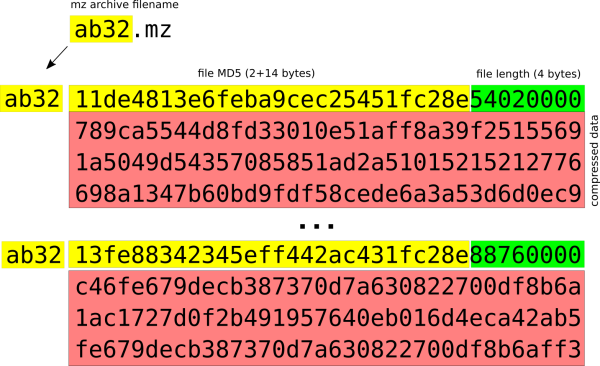

# MZ Archive Specification 

## Background 

Along with the need for storing large amounts of OSS source files, comes the need for an effective compressed archive format, that guarantees a minimum footprint and maximum write performance when appending millions of files. 

In the particular case of minr there is no need to keep any file attributes. All that minr needs is to archive the file contents, connected with its MD5 checksum as unique file identifier.

With all this in mind, given the overhead that any standard archive format would impose for the use case, we created the mz archive. 

# Use case 

MZ archives are created on the fly by minr as it downloads and archives OSS components. These files are only kept temporarily with the purpose of generating wfp fingerprints. 

# MZ archive format 

MZ archives only store the compressed contents of a given file, along with its corresponding md5 checksum. No file names nor any other attributes or metadata is stored.

The MZ archive is composed by 65536 .mz files. They are named from 0000.mz to ffff.mz. The file name contains the first 2 bytes of the file md5, which works as the file key. 

Each .mz file contains a list of all compressed files with the following format: 



Each individual file starts with the last 14 bytes of its MD5 hash, followed by an unsigned 32-bit number storing the length of the compressed file (4 bytes), followed by the compressed data.  

Writing is extremely fast, since data is simply appended to the existing file. 

However, minr first performs a search to avoid inserting duplicate files. The search is automatically reduced to a 65536th part, since it is performed only in the corresponding .mz file. Once there, minr travels the entire file jumping from MD5 to MD5 (skipping the file length) comparing the existing MD5 hashes until it reaches the end of the file. 

## The unmz command 

The unmz command extracts files from a given .mz file, allows directory retrieval and is part of the minr code tree. 

### Command usage:
```
usage: unmz command mzfile
-x extract files
-l list files, validating integrity
-c check .mz container integrity
-h print this help
```
